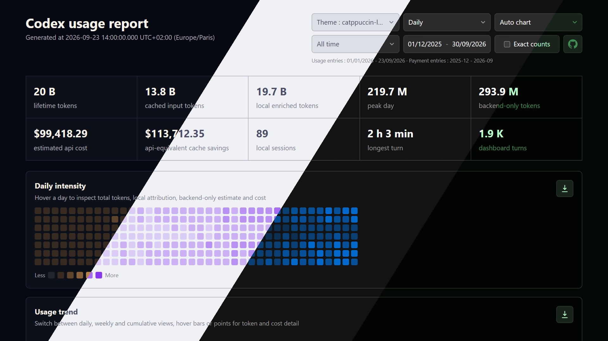

<div align="center">

# Codex usage tool


Generate self-contained, offline Codex usage reports from local `.codex` folders, shared `usage-data.json` files and authenticated ChatGPT/Codex dashboard APIs.  
Combine usage across machines and surfaces, reconciling authoritative backend totals with local rollout details : models, reasoning effort, cached input, output tokens, cost estimates, themes, surfaces and cloud task metadata.



</div>

> [!TIP]  
> Using Cline ? Check out https://github.com/EDM115/cline-usage-tool !

## What it produces

- Interactive `usage-report.html` with Codex-anchored 7d/30d/90d ranges, payment-aware all-time coverage, token heatmaps, smooth trend charts, token-composition drilldowns, subscription ROI, WHAM dashboard breakdowns, daily usage attribution by feature/model/surface/turn start, 5-hour and weekly plan-limit history, top chats, tool activity, messages by model/surface, local-session and prompt-cache metrics, coverage and attribution diagnostics, hover details and per-chart SVG/PNG downloads
- Static SVG/PNG heatmaps and charts for daily, weekly and cumulative views, plus the available attribution, tool activity and message charts
- Version-4 `usage-data.json` with the normalized dataset, event identities, source manifests, local chat metadata, new account analytics, privacy-filtered payment facts, distinct session counts, attribution completeness/certainty, local coverage, parse-cache statistics and merge diagnostics used by the report
- `cost-estimate.csv` for daily token and cost analysis
- Reports styled from the first selected Codex home theme, including named theme fallbacks when the config only stores a theme name

## Preview

  
  
  
  
  
  
  
  
  
  
  
  
  


Generated images : [examples](https://github.com/EDM115/codex-usage-tool/issues/1).  
Run `bun demo:image` to regenerate `demo.png` from the current deterministic demo report. Google Chrome captures a 1280 × 720 viewport at 1.5× density, producing a Full HD 1920 × 1080 image with Daily, Auto chart, All time and abbreviated counts in the EDM115, catppuccin-latte, codex-dark and matrix-dark themes. Set `DEMO_CHROME_PATH` if Chrome is outside its usual location. The four source screenshots are saved in `output/demo-capture/`.

## Data sources

The report combines these sources :

- **Profile API totals** from `/profiles/me` : authoritative daily total token usage when available
- **Local `.codex` enrichment** from streamed rollout JSONL files and SQLite thread databases : model, token breakdown, reasoning effort, source home, distinct sessions, prompt-cache savings at API-equivalent prices, attribution quality and local cost context
- **Generated `usage-data.json` inputs** : portable normalized datasets with source and event identities that can be rendered again or combined with other machines without copying their `.codex` folders
- **WHAM dashboard analytics** from the Codex cloud dashboard : model turns, surface tokens, current and archived task samples, PR metadata, task diff summaries, daily attribution, plan-limit history, tool activity, messages and per-thread plan usage when local thread IDs are available
- **Payment transaction history** from `/payments/transaction-history` when a live Codex home provides an authenticated account ID : paid USD subscription transactions used only for the ROI comparison
- **Explicit monthly payment overrides** from `--payments-json` : a root JSON object such as `{"2026-06":24,"2026-07":119.87}` whose values are USD amounts
- **Pricing metadata** from the live [OpenAI pricing reference](https://developers.openai.com/api/docs/pricing), combined with a bundled effective-dated history and [`models.dev`](https://models.dev/) fallback rows

`hybrid` mode keeps backend totals authoritative and uses local files to explain the visible portion. Backend-only tokens remain included.  
Local enriched tokens can exceed total tokens when the backend has not processed that day's usage yet. The Codex App may likewise show 0 tokens until the next day.

## Installation

```pwsh
git clone https://github.com/EDM115/codex-usage-tool.git
cd codex-usage-tool
bun install --frozen-lockfile
```

Requirements :

- Bun 1.3 or newer
- A readable Codex home, usually `C:\Users\<you>\.codex` or at least one generated `usage-data.json`
- Optional network access for Profile, WHAM dashboard, payment history, theme and pricing refreshes (make sure you're authenticated through the Codex CLI)

## Quick start

```pwsh
bun usage generate --codex-home "C:\Users\EDM115\.codex" --out ./usage
```

Then open `usage/usage-report.html` or serve it with Bun while iterating :

```pwsh
bun usage/usage-report.html
```

Bun serves the generated report at `http://localhost:3000/`.

### Updates

This tool is regularly updated with new features, bug fixes & support for newer models. Simply pull the latest changes :

```pwsh
git pull
bun install --frozen-lockfile
```

## Multiple Codex homes

Pass multiple `.codex` folders to combine usage across desktops, laptops, WSL profiles and backups, adding local detail unavailable in backend totals.

```pwsh
bun usage generate --codex-home "C:\Users\EDM115\.codex" --codex-home "D:\Backups\Laptop\.codex" --codex-root "E:\OldMachines\DesktopProfile" --from 2026-01-01 --to 2026-06-30 --out ./usage
```

`--codex-home` accepts a `.codex` directory. `--codex-root` accepts either a `.codex` directory or a parent directory that contains one.

## Share and combine generated JSON

`--usage-json` accepts a previous run's `usage-data.json`, can be repeated and can be combined with explicit Codex homes or roots. Only this portable file needs to move between machines. Generation also merges event identities and dated WHAM buckets from an existing `--out/usage-data.json` before replacing it, preserving API history no longer returned. `--no-history` ignores that saved output. Back it up before moving the output directory or changing sources : retaining historical API buckets requires the previous JSON.

Rebuild every JSON, CSV, SVG, PNG and HTML artifact from one shared dataset :

```pwsh
bun usage generate --usage-json "D:\Shared\usage-data.json" --out ./usage
```

Combine several shared datasets with this machine's local Codex history :

```pwsh
bun usage generate --codex-home "$env:USERPROFILE\.codex" --usage-json "D:\Laptop\usage-data.json" --usage-json "D:\Workstation\usage-data.json" --out ./usage
```

Explicit `--usage-json` inputs without an explicit `--codex-home` or `--codex-root` disable home discovery, keeping the recipient's history out. Current portable files deduplicate local events and sources by event identity. WHAM daily buckets merge by UTC date, with the newest fetched snapshot winning overlaps, plan periods merge by period ID and top chats by thread ID. Aggregate totals are rebuilt from dated buckets to avoid counting the same account per machine.  
Legacy aggregate-only JSON is accepted and migrated in memory without rewriting the source. Exact event overlap cannot be recovered. If source manifests overlap, the later aggregate is skipped and `legacyOverlaps` appears in JSON, CLI warnings and HTML.  
Version-2 files upgrade in memory to version 4 with an unavailable payment block, sources are never rewritten. Since version 3, API payment facts contain only a SHA-256 transaction fingerprint, month and USD amount. Fingerprints deduplicate invoices across inputs, distinct paid transactions in a month are summed. Imported monthly overrides use first-input precedence. Current `--payments-json` values override all imported values for that month, including an explicit zero.  
Portable JSON retains its timezone because daily buckets are already computed. All combined files and any explicit `--timezone` must match. Active pricing reprices each daily model/service-tier breakdown using that date's alias, default model and effective price before rebuilding multi-day totals. When every portable input has event-level data, `--from` and `--to` filter dated local events, daily WHAM buckets, tool activity, top chats with known update dates and overlapping plan periods in generated JSON. Aggregate-only legacy inputs cannot be reliably re-filtered.  
Rollout JSONL files are streamed. Parsed event manifests are cached in the gitignored `.cache/codex-usage-tool` directory using versioned file-state keys. Unchanged files reuse the cache, size or modification-time changes, including growing active transcripts, trigger a full re-read. Cached parse diagnostics are replayed so warm scans still disclose partial coverage. Major tool versions can change the cache versionning, check for older versions from time to time to free up space.

## Interactive ranges, composition & ROI

### Date ranges and counts

The report opens on 30 days ending at the newest Codex daily entry, not the browser date. The 7d/30d/90d presets use that anchor regardless of payment dates, their calendar starts are not clamped.  
All time spans the earlier of the first Codex day or oldest payment month's first day through the later of the last Codex day or newest payment month's last day. Exact usage-day coverage and month-precision payment coverage are shown separately.  
Click either range boundary to open an unbounded native calendar. Manual edits select Custom and can extend beyond the discovered horizon. All interactive charts, tooltips, breakdowns and downloads share the selected range.  
Exact counts toggles integer counts in tooltips and visible rows between abbreviated and grouped exact values. Money, percentages, fractional credits and dates retain their formats.

### Token composition

Usage Breakdown shows Token composition (local input, local output, unknown), Input details (cached/uncached) and Output details (visible/reasoning). Unknown tokens are never assigned invented components: the tooltip separates backend-only tokens from residuals between local total and local input plus output. Malformed cached or reasoning subset counters are clamped and disclosed to prevent negative segments.

### Return on investment

ROI compares selected-range subscription spend with estimated API-equivalent usage value. Partial months allocate `monthly amount / calendar days in month` per selected day.

- `Value coverage = estimated API value / amount paid * 100`
- `ROI = (estimated API value - amount paid) / amount paid * 100`
- Both are `N/A` when selected spend is zero.
- Payment-only months before Codex usage remain in All time, with their spend, zero API value and `-100%` ROI.

The comparison uses cent-rounded amounts: green (`#50fa7b`) when API value exceeds spend, red (`#ff5555`) when spend exceeds value and yellow (`#f1fa8c`) at break-even. Smooth red spend and green API-value curves use the left money axis, a smooth yellow conventional-ROI curve uses the right percentage axis. Zero-spend months leave gaps in the ROI curve. Missing payment evidence shows as unavailable, not zero, partial API history retains a warning. SVG/PNG exports include the selected range, all three curves and both axes.

## Commands

```text
generate   Collect data and write HTML, SVG, PNG, JSON and CSV outputs
collect    Collect data and write usage-data.json, usage-report.html and cost-estimate.csv only
help       Show CLI help (default)
```

## Options

```text
--codex-home <path>                        Add a .codex directory, repeatable
--codex-root <path>                        Add a parent directory containing .codex, repeatable
--usage-json <path>                        Add a generated usage-data.json, repeatable
--no-history                               Ignore an existing --out/usage-data.json instead of merging its history
--out <path>                               Output directory (default : outputs/codex-usage)
--from YYYY-MM-DD                          Inclusive date filter, unavailable with --usage-json
--to YYYY-MM-DD                            Inclusive date filter, unavailable with --usage-json
--timezone <tz>                            IANA timezone for local rollouts (default : Europe/Paris), JSON keeps its timezone
--source hybrid|backend|local              Default : hybrid, backend totals plus local enrichment
--profile-json <path>                      Use a saved /profiles/me JSON response instead of calling the API
--analytics-json <path>                    Use saved WHAM analytics JSON instead of calling the dashboard APIs
--sections <list>                          Comma-separated report sections (default : all), ex feature,turn or all,-chats
--payments-json <path>                     Override monthly USD spend with a {"YYYY-MM": amount} root object
--no-api                                   Do not call Profile, WHAM or payment APIs, explicit JSON files still load
--base-url <url>                           Backend base URL (default : https://chatgpt.com/backend-api)
--pricing-source openai|bundled|models.dev Default : OpenAI current pricing plus bundled effective-dated history
--pricing-json <path>                      Use flat current-date or effective-dated custom pricing JSON
--estimate-model <model>                   Explicit override for missing models, otherwise infer the historical primary
--no-png                                   Skip static PNG export and write SVG/HTML/JSON/CSV only
--silent                                   Hide action lines, file count and warnings, keep the progress bar and token summary
--theme <theme>                            Default : EDM115, can also be "config" for your `config.toml` one or any of the built-in Codex themes
--help                                     Show help
```

## Output files

```text
usage-report.html                              Interactive offline report
usage-data.json                                Normalized report dataset
cost-estimate.csv                              Daily token and estimated-cost table
heatmap-{daily,weekly,cumulative}.{svg,png}    Daily/weekly/cumulative token intensity heatmap
{area,bar}-{daily,weekly,cumulative}.{svg,png} Daily/weekly/cumulative token trend chart
usage-{feature,models,surfaces,turn}.{svg,png} Daily attributed usage charts when account data is available
{plugin,skill}-activity.{svg,png}              Daily account tool activity charts when available
messages-{model,surface}.{svg,png}             Daily account message charts when available
```

PNG export uses `@resvg/resvg-js` for static files. If the native renderer is unavailable, SVG and HTML outputs are still written.

## Authentication and privacy

Live API calls read `auth.json` from the first configured Codex home and send the access token only in request headers. Payments also require `tokens.account_id`. JSON-only runs do not discover local auth to fetch payments, use `--payments-json` for offline spend comparisons. `--no-api` disables live payment fetching but still loads explicit payment files.  
Generated reports, JSON, CSV, SVG, PNG and logs exclude access tokens, account IDs, raw transaction IDs, invoice URLs, pagination cursors and query-bearing payment URLs. Accepted transactions must be paid, positive, integer-cent USD amounts with valid timestamps, portable output replaces transaction IDs with SHA-256 fingerprints. API failures produce bounded, normalized warnings and fall back to readable local data. Use `--profile-json`, `--analytics-json` and `--payments-json` for reproducible offline reports.  

### Sections and chat data

`--sections` accepts `all` and :

```text
summary,intensity,trend,roi,models,surfaces,cloud,skills,thinking,mode,cyber,token,input,output,details,feature,turn,chats,limits-feature,limits-model,limits-surface,limits-turn,messages-model,messages-surface
```

Values apply in order: `all,-chats` selects everything except Top chats, a leading exclusion starts from all. Excluded sections and their dedicated embedded data are removed from HTML, not hidden with CSS.  
Excluding `chats` also removes local chat metadata and per-chat usage from HTML and `usage-data.json`, both include chat titles by default. `cloud` controls cloud task data in portable JSON, though HTML no longer has a Cloud tasks card. Archival JSON can retain other personal metadata: review it separately before sharing.  
Top chats uses the 100 most recently updated local roots, including portable sources from other machines. Limit usage comes from the account API, without local token-to-limit conversion. The date selector filters chats by update date. Repeated `codex-auto-review` and `Untitled chat` rows are grouped with a chat count.  
`cyber` reads each rollout turn's `payload.cyber_access_program`, defaults missing/unknown values to `standard` and shows a breakdown only if the selected range includes Daybreak Blue or Daybreak Red usage.

### Account analytics

Daily attribution, workspace messages, plugin activity and skill activity are fetched in consecutive windows of up to 120 days across the report horizon. The HTML date selector filters displayed days, `--from`/`--to` bound collection and portable JSON. Plugin/skill requests ask for up to 500 categories per day. `[I/X]` tracks WHAM requests. Existing output JSON preserves dated buckets no longer returned by the API.  
Plan usage history reads `used_basis_points` and category `basis_points` from `/wham/usage/plan_limit_history?days=30`, dividing by 100 for display. Live checks found only `days=7` and `days=30` accepted, both returned three weekly periods for the tested Plus account. Available periods, including five-hour periods, depend on the account/API. Turn-start rows cover Tasks only and may not sum to the full-period percentage.  
The daily total-usage API labels attribution values `units: "percent"`. These determine relative day heights, legend shares divide each category by that day's attribution total. They are not treated as plan-limit percentages. Messages use the analytics API's daily `turns` counts.

## Themes

HTML and images use the first selected Codex home's configuration. Explicit desktop colors take priority. For name-only themes, the tool tries upstream `openai/codex` definitions, then bundled palettes for common Codex themes.

## Development

For pricing-cache refreshes, see [the pricing maintenance guide](./PRICING-MAINTENANCE.md). It maps model entries, aliases, effective dates, parser formats, report colors, generated fixtures and validation to their files.  
Root [`demo.json`](./demo.json) is a deterministic, fully synthetic dataset covering local usage, cloud analytics, plan limits, top chats, tool activity, messages, capability, source, cache, attribution, payment and ROI views without user data. Refresh the tracked fixture after report-schema changes :

```pwsh
bun run demo
```

Generate a report from the serialized fixture :

```pwsh
bun run demo:report
```

This writes `output/demo/usage-report.html`, a self-contained report you can open, share or screenshot. `output/` is gitignored, keeping generated presentation files out of Git.

```pwsh
bun test
bun typecheck
bun usage generate --codex-home "C:\Users\EDM115\.codex" --out ./usage
```

Keep the HTML report self-contained. Cover renderer regressions with tests that extract and parse its executable script blocks.

## Notes on cost estimates

Costs are best-effort operational estimates, not billing statements. Explicit local models resolve through their usage-date aliases. For missing models or backend-only tokens, the tool selects the newest model released by that date and eligible as the primary Codex model. `--estimate-model` overrides this inference.  
Bundled model definitions start on documented release dates, price periods last until the next period for that model.  
Live pricing supplements this history. A fetched rate that differs from the active bundled rate starts on the fetch date, preserving older prices for older usage. Effective-dated custom JSON uses `effectiveFrom` (`YYYY-MM-DD`), legacy flat rows start on the report's fetch date.  
Cached input, output, service tiers, long-context requests and backend-only tokens use the selected model's usage-date price. Cache savings measure the API-equivalent difference between uncached and cached-input prices for the same dated model/tier, not a subscription refund. Official OpenAI billing exports remain authoritative for accounting.
